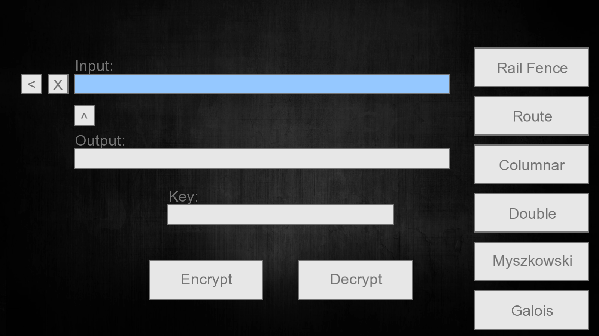

# TranspositionCipher (December 2016)
Cryptography project implementing five transposition ciphers and Galois cipher. UI was made from scratch. Made in C++ with SFML. Rebuilt in August 2019 with SFML 2.5.1.

## Project Description
Implemented five transposition ciphers:
* Rail Fence
* Route
* Columnar
* Double Columnar
* Myszkowski

and in addition, also implemented
* Galois Cipher

All ciphers are derived from a BaseCipher.

Encryption and Decryption are done on the fly, meaning that as you type into the Input field, encrypted/decrypted text is generated in the output field. (if the corresponding button is selected)

##### Preview of encrypting and decrypting with each cipher, in order.

##### Regarding keys
* Rail Fence takes an *integer* as a key
* Route does not take any key
* Columnar takes a *string* as a key
* Double Columnar takes two strings separated by a '/' in the Key textbox field
* Miszkowski takes a *string* as a key
* Galois takes no key

## Usage
* '<' button resets Input text field to default string
* '^' moves the string from the Output text field to the input text field
* 'X' empties the Input text field
* Select a cipher from the right panel to start encrypting/decrypting
* Press either encrypt or decrypt to perform the operation
* Text can also be copied and pasted with Ctrl+C and Ctrl+V respectively.
